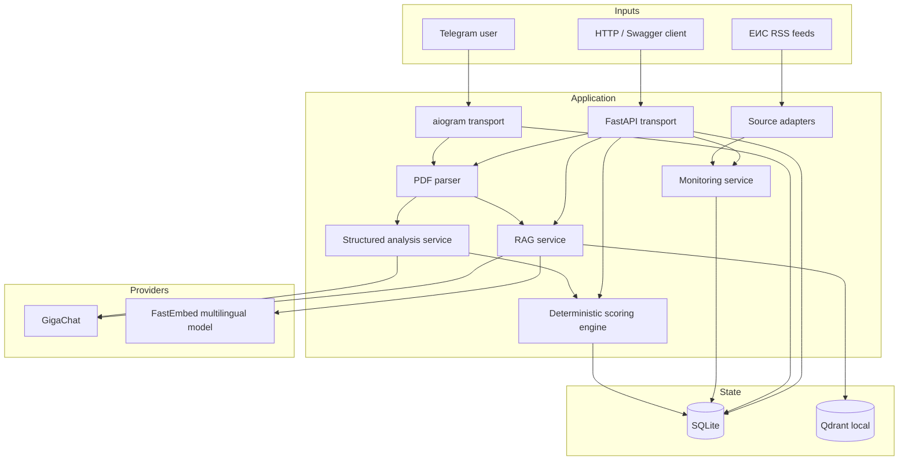

# TenderLens AI — architecture

## System view



## Boundaries

### Transport layer

`app.bot` and `app.api` are independent transports. They orchestrate existing services rather than duplicating scoring formulas, parsing logic or provider code.

### PDF and structured analysis

`app.parsers` reads bounded text from PDF pages. `app.services.tender_analysis` builds a strict JSON-only prompt and validates the LLM result into `TenderAnalysis`. Unknown values stay unknown instead of being fabricated.

The history database stores structured analysis/scoring metadata and SHA-256, not raw PDF bytes or the complete extracted document text.

### Deterministic scoring

`app.scoring` compares structured facts with a versioned `CompanyProfile`. The output separates:

- weighted fit for known criteria;
- completeness of extracted facts;
- document risks;
- explicit hard-stop factors.

Fit is not a probability of winning and not a participation decision.

### Persistence and deduplication

`app.database.TenderRepository` uses SQLite for the single-node MVP. `(owner_user_id, pdf_sha256)` prevents exact PDF duplicates within one Telegram/API owner scope.

Monitoring uses the same SQLite file but separate state/tables for seen notices and subscriptions.

### Semantic RAG

`app.rag.chunking` creates page-aware overlapping chunks. `FastEmbedEmbeddingProvider` uses a multilingual ONNX model locally. `QdrantVectorStore` stores chunk text, metadata and vectors. Retrieval always filters by owner and document hash before the retrieved context is sent to the LLM.

Changing embedding dimensionality requires a new Qdrant collection name instead of reusing an incompatible index.

### Monitoring

`EisRssSource` normalizes configured ЕИС RSS feeds into `TenderNotice`. RSS filters are operator-controlled through URLs in `.env`; business search terms are not hard-coded into the adapter.

Monitoring is intentionally a **pre-filter**. RSS metadata is not authoritative enough for final scoring; full conditions belong to the document-analysis pipeline.

### API boundary

FastAPI exposes health, history, analysis, scoring, RAG and monitoring. `/api/v1/*` can be protected by `TENDERLENS_API_KEY`; `/health` and OpenAPI stay available for readiness/documentation.

The optional API key is not a substitute for real identity and authorization in an internet-facing multi-user service.

## Deployment topology

```text
Host / Docker Desktop / Linux
          |
  127.0.0.1:8000
          |
+--------------------------+
| TenderLens AI v1.4.0 API |
| Python 3.12 / Uvicorn    |
| non-root uid 10001       |
+------------+-------------+
             |
        named volume
          /app/data
         /        \
    SQLite       Qdrant local
                   |
             FastEmbed cache
```

The Docker image excludes `.env`, `.venv` and `data/`. Runtime secrets come from the environment. The named volume persists SQLite, Qdrant local data and FastEmbed cache.

Local SQLite/Qdrant are intentionally owned by one API process. Do not mount the same local Qdrant directory into several replicas. A horizontally scaled architecture should use PostgreSQL and Qdrant server/Cloud.

## Network and TLS

- `OUTBOUND_PROXY_URL` is the optional shared explicit HTTP proxy.
- `TELEGRAM_PROXY_URL` can override it for Telegram.
- GigaChat/EIS can use the configured CA bundle while TLS verification remains enabled.
- Changing explicit proxy configuration requires a process restart.
- Proxy URLs and credentials are redacted from bot logs.

## Data trust model

1. **RSS metadata** — discovery only.
2. **Extracted PDF text** — primary input for tender facts, but still requires human verification.
3. **LLM output** — structured interpretation, validated by schema but not guaranteed factually correct.
4. **Deterministic score** — reproducible calculation over extracted facts/profile, not a legal or commercial recommendation.
5. **RAG answer** — grounded in retrieved chunks and pages, still subject to retrieval/model error.

This separation is central to the design: uncertain AI interpretation does not silently become a deterministic business rule.

## Phase 13 — multi-company core

A new `app.companies` boundary persists several validated `CompanyProfile` workspaces per owner. The active workspace is resolved at request/message time and injected into monitoring and scoring. EIS monitoring can generate per-company RSS searches from `search_keywords`, while static `EIS_RSS_URLS` remains a fallback. Monitoring deduplication is namespaced by active company.

This is deliberately an application-level tenant scope, not yet public SaaS authentication. The next production boundary is authenticated users + organization memberships in PostgreSQL.
