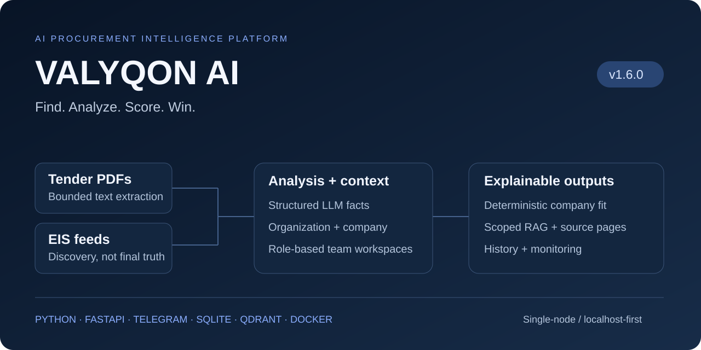
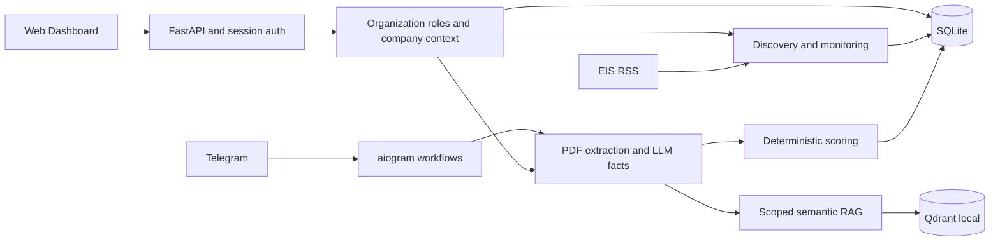

# TenderLens AI

**Tender intelligence for teams — from opportunities to explainable document insights.**

Monitor EIS feeds, extract facts from PDFs, compare tenders with a company profile,
and ask questions grounded in source pages. Web and Telegram workflows share a Python
backend; v1.6.0 adds organizations, RBAC and invitation-based team onboarding.

[](https://github.com/Ramzes2023/TenderLens-AI/actions/workflows/ci.yml)
[](https://github.com/Ramzes2023/TenderLens-AI/releases/tag/v1.6.0)




[Quick demo](docs/DEMO.md) · [Architecture](ARCHITECTURE.md) · [Interview notes](docs/PORTFOLIO.md) · [Security](SECURITY.md)

> **Scope:** single-node and localhost-first, not a public production SaaS.
> TenderLens supports a human procurement decision. It does not submit bids,
> predict winning probability or autonomously decide whether to participate.

The company-fit score is **not a probability of winning** and is not an autonomous recommendation to participate in a tender.

## What it does

| Workflow | Result |
|---|---|
| Discover | Configurable EIS RSS feeds produce pre-filtered opportunities; documents remain authoritative. |
| Read | Bounded PyMuPDF extraction and GigaChat produce validated structured tender facts. |
| Compare | Deterministic Python rules explain company fit, completeness and hard-stop factors. |
| Ask | FastEmbed + Qdrant retrieve context for answers with source-page references. |
| Collaborate | Personal/shared workspaces, company profiles, roles and invitations. |
| Reuse | Scoped SHA-256 deduplication avoids repeating full analysis of exact PDFs. |

## Why the engineering is interesting

- **Interpretation is separate from decisions.** The LLM extracts facts; Python evaluates profile fit; a person decides.
- **Identity is explicit.** HttpOnly sessions identify accounts. Membership and role checks authorize organizations; a legacy API key is not organization identity.
- **Retrieval is scoped.** Personal/organization namespace and PDF-hash filters apply before bounded context reaches the model.
- **Identity linking is guarded.** One-time Telegram tickets confirm the user; unsafe PDF/RAG owner migrations are rejected.
- **External boundaries are testable.** Transport, LLM, source adapters and persistence have separate responsibilities and mocked-service tests.

## Teams in v1.6.0

Register a Web account, use its personal workspace, or create a shared organization.
Owners/admins manage supported membership and invitation operations; members perform
writable workspace operations; viewers are read-only for mutations. Backend checks
remain authoritative even when Dashboard controls are hidden.

Email-bound invitations use high-entropy tokens, SHA-256 digests at rest, expiry,
revocation and atomic acceptance. Shared companies, history, analysis, RAG and on-demand
monitoring are isolated from personal namespaces. Telegram linking does not grant
organization membership.

[Dashboard guide](docs/WEB_DASHBOARD.md) · [Tenancy model](SECURITY.md#organizations-roles-and-invitations)

## Architecture



GigaChat supplies generation; FastEmbed runs multilingual embeddings locally.
The [architecture guide](ARCHITECTURE.md) explains the complete service and storage boundaries.

## Tech stack

| Layer | Implementation |
|---|---|
| Runtime / contracts | Python 3.12, Pydantic |
| Interfaces | FastAPI/OpenAPI, aiogram, HTML and plain JavaScript |
| Documents / AI | PyMuPDF, GigaChat provider abstraction |
| Retrieval | FastEmbed multilingual embeddings, Qdrant local |
| State | SQLite accounts, organizations, history and monitoring |
| Delivery | Non-root Docker image, Compose, GitHub Actions |

## Quick start

Use a **fresh checkout for a demo**, not an existing deployment directory.
Requirements: Git and Docker. AI features need provider credentials; real LLM calls
consume API quota and embedding setup downloads model files.

```sh
git clone https://github.com/Ramzes2023/TenderLens-AI.git
cd TenderLens-AI
```

Create local configuration with `Copy-Item .env.example .env` in PowerShell,
or `cp .env.example .env` on Linux/macOS. Edit only your local copy.

Start Web/API first; no Telegram credential is required for this service:

```sh
docker compose up -d --build api
docker compose ps
```

Open [Dashboard](http://127.0.0.1:8000/dashboard),
[Swagger](http://127.0.0.1:8000/docs) and [health](http://127.0.0.1:8000/health).
Register a local account. Missing optional credentials/models may show unavailable
components; the AI pipeline is not ready until its dependencies are configured.

Configure `GIGACHAT_*` for analysis, `RAG_*` for retrieval and `EIS_RSS_URLS` for
discovery. See [deployment](docs/DEPLOYMENT.md) for CA certificates, model-cache setup,
storage and container proxy settings. For Telegram, configure `TELEGRAM_BOT_TOKEN`,
then run `docker compose up -d bot`. Use only one polling process per bot token.

<details>
<summary>Local Python development</summary>

With Python 3.12, create the environment: `python -m venv .venv`.

PowerShell, without activation:
```powershell
.\.venv\Scripts\python.exe -m pip install -r requirements-dev.txt
.\.venv\Scripts\python.exe -m app.api
```

Linux/macOS:
```sh
.venv/bin/python -m pip install -r requirements-dev.txt
.venv/bin/python -m app.api
```

Start `python -m app.bot` in that environment only if the Docker bot is not running.
Do not open the same Qdrant local directory from multiple processes.
</details>

## A useful first demo

1. Sign in, create/select a shared organization and add a company profile.
2. Invite a second demo account as viewer; compare its controls with the owner account.
3. Analyze the [synthetic sample PDF](examples/sample_tender.pdf) through the API or Telegram.
4. Inspect extracted facts and the separate deterministic fit explanation.
5. Ask a paraphrased question and verify the returned page references.
6. Run an EIS scan: distinguish discovery metadata from document truth.

The [5–10 minute walkthrough](docs/DEMO.md) separates Dashboard operations from
API-only analysis/RAG and lists preparation needed before the timed demo.

## Security and data boundaries

Passwords use scrypt. Session cookies are HttpOnly and SameSite=Lax, with Secure on
HTTPS. Organization APIs require session identity and membership; supported personal
integrations retain legacy API-key compatibility. Browser mutations check explicit
cross-site provenance. These controls do not replace public deployment hardening.

Raw PDF bytes are not retained by the history pipeline. SQLite stores structured
results; Qdrant stores chunk text and embeddings. Treat local data as sensitive.
Bounded excerpts may be sent to the external LLM provider.

Read [SECURITY.md](SECURITY.md) before using confidential documents or exposing the service.

## Tests and engineering quality

```powershell
.\.venv\Scripts\python.exe -m pytest -q
.\.venv\Scripts\python.exe -m compileall -q app tests scripts
```

[CI](https://github.com/Ramzes2023/TenderLens-AI/actions/workflows/ci.yml) runs tests,
compilation and a Docker image build. Tests cover sessions, role isolation, invitations,
migration, PDF limits, mocked LLM failures, scoring, deduplication, RAG and monitoring.
The status badge links to actual runs; there is no static test-count claim.

## Implemented scope and next production steps

**Implemented in v1.6.0:** Web/Telegram workflows, organizations/RBAC/invitations,
PDF analysis, deterministic scoring, scoped RAG and configurable EIS monitoring.

**Current limits:** text PDFs only (10 MiB / 200 pages), model output needs verification,
SQLite and Qdrant local are single-node choices, and login throttling is process-local.
API and bot use separate local Qdrant indexes: shared history does not imply a shared
retrieval index. Organization monitoring is on-demand; background team notifications
remain future work.

**Next production steps:**
- Public VPS, domain/DNS, HTTPS and reverse-proxy hardening.
- PostgreSQL with proper migrations; Qdrant server/Cloud for multi-process retrieval.
- Distributed/edge rate limiting, structured audit events and observability.
- Tested backups/restores, retention policies and secret rotation.
- OCR, more procurement source adapters and background organization notifications.

These are planned work, not current capabilities or a security certification.

## Documentation

| Guide | What to inspect |
|---|---|
| [Architecture](ARCHITECTURE.md) | Service boundaries, persistence and tenancy |
| [Security](SECURITY.md) | Identity, data handling and deployment constraints |
| [Web Dashboard](docs/WEB_DASHBOARD.md) | Workspaces, roles and invitations |
| [Deployment](docs/DEPLOYMENT.md) | Docker, storage, model cache and networking |
| [Demo](docs/DEMO.md) | A prepared 5–10 minute walkthrough |
| [Portfolio](docs/PORTFOLIO.md) | Design decisions and interview questions |
| [API orientation](docs/API_REFERENCE.md) | Route map; full schema at `/docs` |
| [Multi-company behavior](docs/MULTI_COMPANY.md) | Active profiles and sell/buy boundaries |
| [Contributing](CONTRIBUTING.md) | Local checks and contribution scope |
| [Project status](PROJECT.md) | Implemented scope and verification history |

## Release and reuse

[**v1.6.0 release**](https://github.com/Ramzes2023/TenderLens-AI/releases/tag/v1.6.0)
· [Release notes](RELEASE_NOTES_v1.6.0.md) · [Roadmap](TASKS.md)

No LICENSE file is currently included; no open-source license grant is asserted.
Ask the author about reuse permissions.
