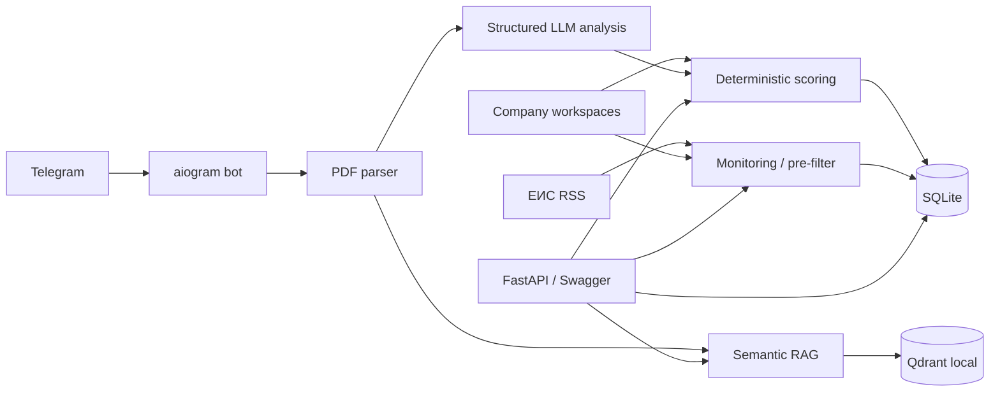

# TenderLens AI

**TenderLens AI v1.6.0** is a portfolio-grade Python platform for tender monitoring and document intelligence. It combines authenticated Web accounts, shared organization workspaces with role-based access, invitation flows, Telegram workflows, live EIS RSS monitoring, PDF extraction, structured LLM analysis, deterministic company-fit scoring, organization-isolated semantic RAG with Qdrant, SQLite persistence, a FastAPI backend, an authenticated browser dashboard, and Docker deployment.

> The system supports a human procurement decision; it does **not** autonomously decide whether to participate in a tender or submit bids.

## What it demonstrates

- **Web accounts:** email/password registration, HttpOnly session cookies, personal workspace compatibility and authenticated Dashboard.
- **Organizations + RBAC:** shared workspaces, owner/admin/member/viewer roles, membership management, shared companies, active-company context and session-only organization APIs.
- **Invitations:** email-bound one-time organization invitations with SHA-256 token digests, expiration, revocation, replay protection and browser accept flow.
- **Telegram bot:** PDF upload, history, RAG questions, EIS monitoring and subscriptions.
- **Web ↔ Telegram identity:** one-time deep-link confirmation safely moves a fresh Web owner namespace to the verified Telegram user ID while preserving supported owner-scoped state.
- **Tender analysis:** PyMuPDF → structured `TenderAnalysis` → GigaChat provider abstraction.
- **Multi-company workspaces:** one owner can keep several company profiles and switch the active profile without restart.
- **Deterministic scoring:** transparent Python rules against the active versioned company profile.
- **Semantic RAG:** page-aware chunks → multilingual FastEmbed embeddings → Qdrant local-mode retrieval → grounded LLM answer with page references.
- **Persistence:** personal and organization-isolated SQLite history with SHA-256 deduplication.
- **Live tender discovery:** configurable RSS feeds from ЕИС / zakupki.gov.ru with pre-filtering and deduplication.
- **Backend API:** FastAPI + OpenAPI/Swagger for history, scoring, PDF analysis, RAG and monitoring.
- **Deployment:** non-root Docker image, healthcheck, persistent named volume and localhost-only bind by default.
- **Engineering:** typed configuration, provider boundaries, unit/integration tests, CI, secret-safe defaults and documented limitations.

## Architecture



Detailed boundaries and data flow: [`ARCHITECTURE.md`](ARCHITECTURE.md).

## Quick start — Docker API + Telegram bot

Requirements: Docker Desktop / Docker Engine and a local `.env` created from `.env.example`.

```powershell
Copy-Item .env.example .env
# Edit .env and add only the credentials/features you want to use.
docker compose build
docker compose up -d
docker compose ps
curl.exe http://127.0.0.1:8000/health
```

On the first fresh Docker volume, initialize the local semantic embedding cache once:

```powershell
docker compose exec -e OUTBOUND_PROXY_URL= api python -m app.rag.health
docker compose restart api
```

Swagger UI: `http://127.0.0.1:8000/docs`

`docker compose up -d` starts two long-running services: `api` and `bot`. The bot keeps Telegram polling and EIS background monitoring alive even after the PowerShell window is closed.

Automated local smoke check:

```powershell
.\.venv\Scripts\python.exe scripts\smoke_api.py
```

Expected health shape:

```json
{
  "status": "ok",
  "service": "TenderLens AI",
  "version": "1.6.0",
  "components": {
    "database": "ready",
    "llm": "ready",
    "scoring": "ready",
    "companies": "ready",
    "rag": "ready",
    "monitoring": "ready"
  }
}
```

## Local Python setup

Python 3.12 is the supported development runtime.

```powershell
cd C:\Users\ramze\Documents\Codex\tender-ai
.\.venv\Scripts\python.exe -m pip install -r requirements-dev.txt
if (!(Test-Path .env)) { Copy-Item .env.example .env }
.\.venv\Scripts\python.exe -m pytest -q
```

Run the API locally:

```powershell
.\.venv\Scripts\python.exe -m app.api
```

Run the Telegram bot locally:

```powershell
.\.venv\Scripts\python.exe -m app.bot
```

Docker Compose runs both the API and Telegram bot. They share SQLite history and the FastEmbed model cache, while each process uses its own Qdrant local directory because Qdrant local mode is file-backed and cannot safely be opened by multiple processes against the same storage path. For a production multi-service deployment, migrate to PostgreSQL and Qdrant server/Cloud.

## Telegram workflow

Useful commands:

- `/start`, `/help`, `/status`
- `/history` — latest processed tenders for the current Telegram user
- `/ask <question>` — semantic RAG question about the latest indexed PDF
- `/tenders` — manual EIS RSS scan
- `/monitor_on`, `/monitor_off`, `/monitor_status` — background EIS notifications
- `/companies`, `/company_show` — company workspaces
- `/company_add ...`, `/company_use <id>` — create/switch the active company profile
- `/link <code>` — confirm a Web-to-Telegram account link (the Dashboard deep link is the normal entry point)

PDF constraints: up to 10 MiB and 200 pages. Text PDFs are parsed locally. OCR is intentionally not implemented in v1.6.0; scanned-only PDFs are reported as such instead of silently inventing text.

## Main API endpoints

| Method | Endpoint | Purpose |
|---|---|---|
| GET | `/health` | Service/component readiness |
| POST | `/api/v1/auth/register` | Create Web account and session |
| POST | `/api/v1/auth/login` | Authenticate and create session |
| POST | `/api/v1/auth/logout` | Invalidate current session |
| GET | `/api/v1/auth/me` | Current authenticated account |
| POST | `/api/v1/auth/telegram-link` | Create a short-lived Telegram deep-link ticket |
| GET | `/api/v1/companies` | Personal/legacy owner-scoped company profiles |
| POST | `/api/v1/companies` | Create personal company profile |
| POST | `/api/v1/companies/{id}/activate` | Switch personal active company |
| GET | `/api/v1/organizations` | Organizations visible to the current Web account |
| POST | `/api/v1/organizations` | Create a shared organization |
| GET | `/api/v1/organizations/{id}/members` | Owner/admin membership management view |
| POST | `/api/v1/organizations/{id}/invitations` | Create an organization invitation |
| GET | `/api/v1/organizations/{id}/companies` | Shared organization company workspaces |
| POST | `/api/v1/organizations/{id}/companies` | Create a shared organization company |
| GET | `/api/v1/organizations/{id}/tenders` | Organization-scoped tender history |
| POST | `/api/v1/organizations/{id}/analysis/pdf` | Organization-scoped PDF analysis |
| POST | `/api/v1/organizations/{id}/rag/ask` | Organization-scoped semantic RAG |
| GET | `/api/v1/tenders` | Personal/legacy owner-scoped tender history |
| GET | `/api/v1/tenders/{id}` | Tender detail |
| POST | `/api/v1/analysis/pdf` | PDF analysis pipeline |
| POST | `/api/v1/scoring/evaluate` | Deterministic fit score |
| POST | `/api/v1/rag/ask` | Grounded question answering |
| GET | `/api/v1/monitoring/status` | Monitoring status |
| POST | `/api/v1/monitoring/scan` | Manual source scan |

Browser Web flows use the HttpOnly `tenderlens_session` cookie. Session-authenticated personal endpoints resolve the owner from the account instead of trusting a browser-supplied owner ID. Organization endpoints use account membership plus role checks and do not accept the legacy API key as organization identity. The legacy `X-API-Key` path remains available only for supported personal/integration compatibility when `TENDERLENS_API_KEY` is configured. `/health` and OpenAPI remain accessible for local readiness/documentation.

## Configuration

`.env.example` contains the supported settings and **no secrets**. Important groups:

- Telegram: `TELEGRAM_BOT_TOKEN`, `TELEGRAM_PROXY_URL`
- Shared networking: `OUTBOUND_PROXY_URL`
- LLM: `GIGACHAT_*`
- Persistence: `DATABASE_URL`, `DATA_DIR`
- Scoring: `COMPANY_PROFILE_FILE`
- RAG: `RAG_*`, `FASTEMBED_CACHE_PATH`
- Monitoring: `EIS_RSS_URLS`, `EIS_PROFILE_FEEDS_ENABLED`, `EIS_PROFILE_FEED_LIMIT`, `MONITOR_*`
- API: `API_HOST`, `API_PORT`, `TENDERLENS_API_KEY`
- Docker: `TENDERLENS_DOCKER_BIND`, `TENDERLENS_DOCKER_PORT`, `DOCKER_OUTBOUND_PROXY_URL`, `DOCKER_TELEGRAM_PROXY_URL`

Never commit `.env`, API keys, bot tokens, local databases or Qdrant data.

## Tests and CI

```powershell
.\.venv\Scripts\python.exe -m pytest -q
.\.venv\Scripts\python.exe -m compileall -q app tests scripts
```

GitHub Actions runs the test suite, bytecode compilation and a Docker image build on pushes and pull requests.

## Data and trust boundaries

- Raw PDF bytes are not persisted by the analysis/history layer.
- SQLite stores structured analysis/scoring metadata and hashes.
- Qdrant stores RAG chunks and embeddings; treat `data/` as sensitive local application data.
- A bounded text excerpt can be sent to the configured external LLM provider.
- EIS RSS is only a discovery/pre-filter source; authoritative tender conditions must be verified in source documents.
- Fit score means compatibility with the configured company profile, **not** probability of winning and not a participation recommendation.

See [`SECURITY.md`](SECURITY.md) for threat model and [`docs/DEPLOYMENT.md`](docs/DEPLOYMENT.md) for deployment operations.

## Portfolio demo

A reproducible 5–10 minute demo is in [`docs/DEMO.md`](docs/DEMO.md). A synthetic PDF is included at [`examples/sample_tender.pdf`](examples/sample_tender.pdf).

For an interview-oriented description of design decisions and trade-offs, see [`docs/PORTFOLIO.md`](docs/PORTFOLIO.md).

Multi-company behavior and the current sell-side/buy-side boundary are documented in [`docs/MULTI_COMPANY.md`](docs/MULTI_COMPANY.md).

## Current limitations / next production steps

- OCR for scan-only documents.
- Server-backed PostgreSQL and Qdrant for multiple replicas.
- Structured audit events and server-backed tenancy infrastructure for larger public multi-tenant deployments.
- Public VPS/domain/HTTPS deployment and reverse-proxy hardening.
- The login limiter is intentionally in-process for the single-node release; distributed/edge throttling is still required before multi-replica public deployment.
- Supplier-intelligence adapters for `buy` profiles and international procurement sources.
- Observability/metrics, migrations and retention policies.
- More tender source adapters (B2B-Center, РТС-тендер, Сбербанк-АСТ, Росатом).
- Optional alternative LLM provider implementation.

These are deliberate boundaries of v1.6.0, not hidden capabilities.

## Web accounts, organizations and Dashboard

Phase 17 introduced authenticated Web accounts, session cookies and Web-to-Telegram identity linking. Phase 18 adds a second tenancy layer for shared customer teams: personal organizations, shared organizations, explicit owner/admin/member/viewer memberships, organization-scoped companies and active-company context, tender history, scoring, monitoring, PDF analysis, RAG and email-bound invitation acceptance.

The Dashboard keeps the personal v1.5-compatible workspace available while allowing the user to switch into shared organization workspaces. Viewer roles are read-only for mutations; owner/admin/member permissions are reflected in the UI while backend authorization remains authoritative. Organization APIs are session-only and the legacy API key is not organization identity.

Password hashes use scrypt. Session cookies are HttpOnly + SameSite=Lax and become Secure on HTTPS. Browser state-changing requests are protected against explicit cross-site provenance using `Origin` / `Sec-Fetch-Site`, login failures are bounded by an in-process limiter, and expired sessions are cleaned as new sessions are created.

v1.6.0 remains intentionally single-node and localhost-first. The organization boundary is implemented, but public multi-replica SaaS deployment still requires HTTPS/reverse-proxy hardening, shared rate limiting, structured audit logging, PostgreSQL/migration tooling and server-backed Qdrant.
